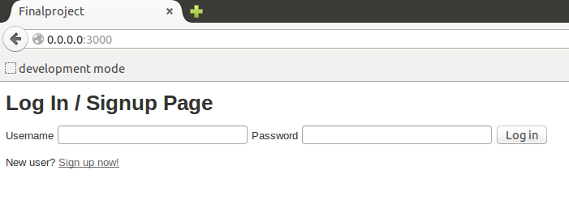
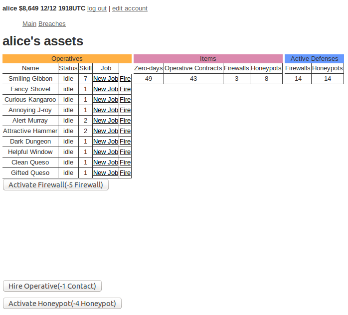
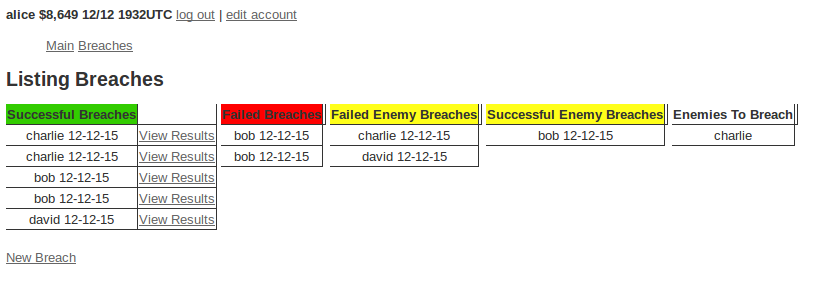

== README

<h3>Ruby version 2.2.1</h3>
<h3>System dependencies</h3>

 Bcrypt gem was utilized for the Session Controller.  It offeres the core functionality of devise while providing easy salting and hashing of passwords.  A simple has_secure_password in the model will take care of all encryption and verification.

Database creation

<h3>Abstract</h3>

This project was a simple test of 3 things
-building the login/user session management
-allowing user actions to affect other users data
-creating a self joining table that would allow relationships between many-to-many usersto be stored

After users login/signup they will be given 4 "operativs".  This object acts as a way to generate resources and items that can be used to defend against incursions from other users or to attack other users.  The generation of resources is mostly random as it was the quickest to implement.  Once the user feels ready they can select another user to "attack".

The attack will be calculated using pre-existing values in the user's table as well as randomly generated numbers.  So no attack will be the same.  The attacking player will either be rewarded with a large percentage of the target's assets or they will be punished by receiving nothing and ending up on the "Enemy Users" list of the attack target.

<h3>Login/Signup Session System</h3>

This bare bones sign-in system is actually just a Sessions controller that I created.  It captures a user's login/signup and then verfies the password hash stored within the User's table.  Once verified the user information is assigned to a @current_user class variable.  This current_user variable can be used just like it is in the Devis gem.
  

I went with rolling my own sessionn manager because my intital plan for the project called for Users to choose or be assigned a very simple password that would eventually be stolen as part of the meta-game.  There is just less complexity involved in creating something specific like this from scratch than forcing myself to adapt to Devise's structure.

<h3>Main Menu/Asset Overview Screen</h3>

From this main console the user can assign defensive values via the Activate Firewall button and the Activate Honeypot button.  The user can lso see their current cash value in the upper left corner on every view in the application.  Each creates a different number to be calculated during an attack on our current_user Alice.  I color coded the different listings between Items that can be used, defensive items that are active, and the list of currently owned operatives.

The operatives are the primary form of item generation.  The offensive items, zero-days, are necessary to create breaches(attacks) on other users.  They will be consumed like tokens as each breach is created.  Stealing items from other players is a secondary form of resource generation and the only current method of generating cash.  Each item will be subtracted or added to the user's total item count as they are stolen and earned.  All breaches are tracked and each value for the success, items stolen, cash stolen, etc is stored for future reference.  Operative Contracts just call operative#create and randomly generates an operative.

<h3>Create/Review Breaches</h3>

The breaches will be sorted by success and failures.  Further categorization separate the current_user's breaches and the breach attacks by enemies.  There is one freebie Enemies_to_breach value so that when users are starting out they have access to user names.  A new breach is created by finding the user_id of the intended target.  The values for the assets stolen are calculated based on the defending user's defensive values.  The stolen asset values are then updated in each user's object in the table.  A viewing of the results is available so users can verify they were awarded the correct amount.

